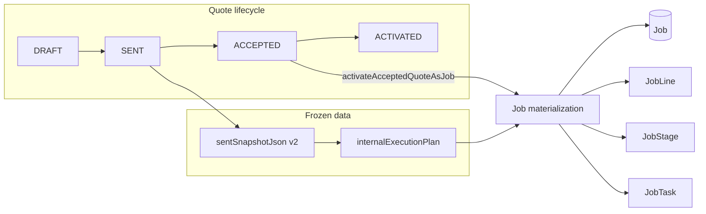

# Phase 4 Implementation Report

**Project:** Struxient v4  
**Scope:** Quote acceptance, job activation from frozen sent snapshot (v2), job workspace (list + detail), job task status updates, RBAC, org isolation, tests.  
**Date context:** Implementation completed in-thread (May 2026).

---

## 1. Executive summary

Phase 4 introduces a **minimal, permanent** path from a **SENT** quote (with validated **sent snapshot v2**) to an internal **job workspace**:

1. **Mark accepted** — Records customer acceptance; transitions quote to `ACCEPTED`; does **not** create a job.
2. **Create job (activate)** — From `ACCEPTED` only, materializes **Job**, **JobLine**, **JobStage**, and **JobTask** rows **exclusively** from `sentSnapshotJson` / `internalExecutionPlan` (no live quote execution reads). Stores the full validated snapshot on `Job.sourceSnapshotJson`, links quote via `Quote.jobId`, sets quote to `ACTIVATED`.
3. **Job task status** — Field workers and above (per matrix) update **JobTask.status** only; quote rows are untouched.

Duplicate activation is prevented by a **unique** `Job.quoteId` constraint plus **pre-transaction** and **in-transaction** guards. Cross-org access is denied by scoping all queries to `organizationId` from the org session.

---

## 2. Goals and explicit non-goals

### In scope

- `QuoteStatus.ACCEPTED` and `QuoteStatus.ACTIVATED`.
- Org-scoped **job display number** (`Job.displayNumber`) via `max(displayNumber) + 1` inside the activation transaction.
- **One job per quote** (`Job.quoteId` unique; `Quote.jobId` optional denormalized pointer).
- **Snapshot-only** activation; `Job.sourceSnapshotJson` = validated v2 payload used at activation time.
- **Lineage** fields: `sourceQuoteLineItemId`, `sourceQuoteStageId`, `sourceQuoteTaskId` on job rows (informational).
- **JobTaskStatus** for runtime tasks; mapping from snapshot quote-line task status: **NOT_STARTED** by default, **BLOCKED** only if snapshot status is `BLOCKED` (does not copy `COMPLETE` / `IN_PROGRESS` from quote execution).
- Quote activity: **`QUOTE_ACCEPTED`**, **`QUOTE_ACTIVATED`** (plus existing **`QUOTE_STATUS_CHANGED`** where implemented).
- UI: quote workspace actions by status; **`/app/jobs`** list; **`/app/jobs/[jobId]`** detail with line → stage → tree and task status control; sidebar **Jobs** link; **`MEMBER`** denied jobs pages via `notFound()` when `canViewJobsWorkspace` is false.
- Server modules under `src/server/phase4/` and permissions in `src/lib/phase4-permissions.ts`.
- Integration + unit tests for Phase 4; regression reliance on existing Phase 2/3 tests in suite.

### Out of scope (not added in this phase)

- Customer portal, e-sign, payments, scheduling, change orders, uploads, FlowSpec, marketplace, dedicated “scope” product pages.
- **`JOB_TASK_STATUS_UPDATED`** event or a **JobActivity** table (MVP uses task `updatedAt` / simple revalidation only).
- Evidence requirements for task completion in Phase 4.

---

## 3. Architecture overview



**Source of truth for activation:** `Quote.sentSnapshotJson` after Zod validation (`sentQuoteSnapshotV2Schema`). The same parsed object is persisted on **`Job.sourceSnapshotJson`**. Live tables `QuoteLineExecutionStage` / `QuoteLineExecutionTask` are **not** read inside `activateAcceptedQuoteAsJobInTransaction`.

**How `internalExecutionPlan` is populated:** At **mark sent** (`quoteMutationMarkSent`), the snapshot is built with `buildInternalExecutionPlanFromLineItems(full.lineItems)` — i.e. **line-item execution** only. **Quote prep** tasks (`QuoteTask` / quote-level checklist) are **not** part of that structure, so they are **not** copied onto jobs by design.

---

## 4. Data model and migrations

### Prisma / SQL enums and tables

| Artifact | Purpose |
|----------|---------|
| `QuoteStatus` | Extended with `ACCEPTED`, `ACTIVATED`. |
| `Quote` | `acceptedAt`, `acceptedByUserId`, `activatedAt`, `activatedByUserId`, `jobId` (FK to `Job.id`, unique, nullable). |
| `JobStatus` | `ACTIVE`, `COMPLETED`, `PAUSED`, `CANCELED`. |
| `JobTaskStatus` | `NOT_STARTED`, `READY`, `IN_PROGRESS`, `COMPLETE`, `BLOCKED`. |
| `Job` | Org, `quoteId` (unique), customer, optional opportunity, `displayNumber`, title, `status`, `sourceSnapshotJson`, `activatedAt`, `activatedByUserId`. |
| `JobLine` | Links to job; `sourceQuoteLineItemId`; title, sort order, etc. |
| `JobStage` | Links to job + line; `sourceQuoteStageId`. |
| `JobTask` | Links to job + line + stage; `sourceQuoteTaskId`; **`JobTaskStatus`** and metadata from snapshot. |

### Migration files

| Migration | Summary |
|-----------|---------|
| `20260502140000_phase4_quote_accept_job` | Adds quote acceptance/activation columns and FKs; creates `Job`, `JobLine`, `JobStage`, `JobTask` with indexes and enums; unique `Job_quoteId`. |
| `20260502153000_quote_job_id` | Adds nullable unique `Quote.jobId` with FK to `Job.id` for fast “open job from quote” and spec alignment. |

---

## 5. RBAC (`src/lib/phase4-permissions.ts`)

| Capability | Allowed roles |
|------------|----------------|
| **Mark quote accepted** | OWNER, ADMIN, MANAGER, OFFICE, SALES |
| **Activate accepted quote as job** | OWNER, ADMIN, MANAGER, OFFICE |
| **View jobs workspace** (list + detail routes) | OWNER, ADMIN, MANAGER, OFFICE, SALES, CREW_LEAD, FIELD_WORKER |
| **Update job task status** | OWNER, ADMIN, MANAGER, OFFICE, CREW_LEAD, FIELD_WORKER |

**MEMBER** is denied jobs UI and job task updates by default (view jobs false; task update false).

All mutations additionally require a valid **org session** and load quotes/jobs with **`organizationId`** from that session.

---

## 6. Server implementation

### 6.1 Quote acceptance — `src/server/phase4/quote-accept-activate.ts`

**`quoteMutationMarkAccepted(ctx, formData)`**

- Checks `canMarkQuoteAccepted(ctx.role)`.
- Parses `quoteId` via existing `markQuoteLifecycleSchema`.
- Loads quote in org; must be **`SENT`** (blocks `ACCEPTED` / `ACTIVATED` / `DECLINED` / `REVISED` and other statuses with clear copy).
- Validates `sentSnapshotJson` with **`sentQuoteSnapshotV2Schema`**.
- Updates quote: `status = ACCEPTED`, `acceptedAt = now`, **`acceptedBy: { connect: { id: ctx.userId } }`** (Prisma relation write).
- Records **`QUOTE_ACCEPTED`** and **`QUOTE_STATUS_CHANGED`** via `recordQuoteActivity`.
- Does **not** create job rows or mutate line/stage/task execution structure.

### 6.2 Job activation — `src/server/phase4/job-activation.ts`

**`activateAcceptedQuoteAsJobInTransaction(ctx, quote)`**

- Re-validates snapshot v2; requires **`internalExecutionPlan.lines.length >= 1`** (empty plan blocked with a professional error).
- **`prisma.$transaction`**:
  - Re-checks no existing `Job` for `quoteId`.
  - Allocates **`displayNumber`** = org max + 1.
  - **`job.create`** with `quoteId`, `sourceSnapshotJson` = full validated v2 JSON, `activatedAt`, `activatedByUserId`, etc.
  - Nested creates for lines → stages → tasks from **`plan.lines` only**; new cuid IDs on job side; lineage scalars from snapshot ids.
  - **`quote.update`**: `ACTIVATED`, `activatedAt`, **`activatedBy: { connect: { id: ctx.userId } }`**, **`jobId: job.id`** (denormalized link; required so `Quote.jobId` is populated — `job: { connect }` alone does not set this scalar).
  - **`QUOTE_ACTIVATED`** + **`QUOTE_STATUS_CHANGED`** inside the same transaction client.
- Catches **`P2002`** and internal duplicate sentinel → user-safe “job already exists” message.

**Caller** `quoteMutationActivateAcceptedQuoteAsJob` (same file as accept): checks activate role, duplicate job, org-scoped quote, **`quote.status === ACCEPTED`**, then calls activation.

### 6.3 Job task status — `src/server/phase4/job-mutations.ts` + `validation.ts`

- **`updateJobTaskStatusSchema`**: `jobId`, `taskId`, `status` (native **`JobTaskStatus`** enum).
- **`jobMutationUpdateTaskStatus`**: role check; resolve task by **id + jobId + organizationId**; `update` **status only**.

### 6.4 Job reads — `src/server/phase4/job-queries.ts`

- **`listJobsForOrganization`** — list with customer + quote display number, `updatedAt` desc, cap 100.
- **`getJobWorkspace`** — full tree include for detail page.
- **`getJobIdInOrganization`** — existence guard for routing.

### 6.5 Initial task status mapping — `src/server/phase4/job-task-status-map.ts`

- **`initialJobTaskStatusFromSnapshot`**: snapshot status string **`BLOCKED`** → `JobTaskStatus.BLOCKED`; otherwise **`NOT_STARTED`**.

---

## 7. App Router actions and UI

### 7.1 Quote actions — `src/app/(app)/app/sales/quotes/actions.ts`

| Export | Behavior |
|--------|----------|
| **`markQuoteAccepted`** | `requireOrgSession` → `quoteMutationMarkAccepted` → `revalidateQuote`, `revalidatePath("/app/jobs")`. |
| **`activateAcceptedQuoteAsJob`** | Same → on success: revalidate quote + jobs paths → **`redirect(\`/app/jobs/${jobId}\`)`**. |

### 7.2 Job route actions — `src/app/(app)/app/jobs/[jobId]/actions.ts`

- **`updateJobTaskStatus`** — server action wrapping `jobMutationUpdateTaskStatus` with path revalidation.

### 7.3 Quote workspace — `src/app/(app)/app/sales/quotes/[quoteId]/quote-workspace.tsx`

- **SENT:** “Mark accepted” + explanatory copy (records acceptance; does not create job).
- **ACCEPTED:** “Create job” + copy (materializes from frozen plan).
- **ACTIVATED:** “Open job” link to `/app/jobs/{jobId}` + copy (work in job workspace; quote frozen).
- Uses **`useActionState`** for accept/activate forms.

### 7.4 Jobs pages

- **`/app/jobs`** — Table: display number, title, customer, quote #, status, updated; empty state copy per spec (no demo wording).
- **`/app/jobs/[jobId]`** — Header (title, customer, status, link to source quote); main content: tree + **`job-task-status-form`**; dark, tight styling; no portal/evidence/scheduling/CO UI.

### 7.5 Navigation — `src/components/app-shell/app-sidebar.tsx`

- **Jobs** entry → `/app/jobs`.

---

## 8. Events / history

| Event type | When |
|------------|------|
| `QUOTE_ACCEPTED` | After successful mark accepted. |
| `QUOTE_ACTIVATED` | After successful activation (inside transaction). |
| `QUOTE_STATUS_CHANGED` | After accept and after activate (status transition audit on quote stream). |

No separate job activity stream in MVP.

---

## 9. Security notes

- Every mutation path uses **`OrgSessionContext`** from `requireOrgSession` / test contexts with **`organizationId`** + **`role`**.
- Quote and job task lookups use **composite filters** (`id` + `organizationId`, or task + job org).
- Duplicate job: **DB unique** on `Job.quoteId` + application-level checks + `P2002` handling.
- Jobs routes: early **`notFound()`** if `!canViewJobsWorkspace(role)` to avoid leaking existence to unauthorized roles.

---

## 10. Implementation fix from thread (Prisma writes)

During integration testing, **`Quote.update`** required:

1. **`activatedBy`** / **`acceptedBy`** as **`{ connect: { id } }`** rather than raw `*ByUserId` scalars in the `data` object (avoids validation issues across client versions).
2. **`jobId: job.id`** explicitly when completing activation so **`Quote.jobId`** is set; relying only on **`job: { connect }`** left **`jobId`** null because the canonical FK lives on **`Job.quoteId`**, while **`Quote.jobId`** is a separate denormalized column.

---

## 11. Testing

### Phase 4 tests

| File | Role |
|------|------|
| `src/server/phase4/__tests__/phase4-quote-accept-job.integration.test.ts` | End-to-end DB flows: sales accepts + office activates; RBAC (sales cannot activate; member cannot accept); duplicate/cross-org; activation from SENT without accept denied; live execution title mutation after SENT does not change job task title; job task update does not change quote execution task; snapshot v2 required for accept. |
| `src/server/phase4/__tests__/job-task-status-map.test.ts` | Unit tests for `initialJobTaskStatusFromSnapshot`. |

### Regression (existing suite)

- Phase 2 snapshot / SENT behavior and Phase 3 template tests remain in the repository test set; run full **`npm run test`** before release.

### Recommended verification commands

```bash
npx prisma generate
npx prisma migrate deploy
npm run test
npm run lint
npm run build
```

**Note:** On Windows, `npx prisma generate` may fail with **`EPERM`** if another process locks `node_modules/.prisma/client/query_engine-windows.dll.node`. Close locking processes (IDE, other Node processes) and retry.

---

## 12. Environment variables

No new Phase-4-specific env vars. Standard app requirements apply (e.g. **`DATABASE_URL`** for Prisma and integration tests).

---

## 13. File inventory (Phase 4–centric)

### Created / primary ownership

- `src/lib/phase4-permissions.ts`
- `src/server/phase4/quote-accept-activate.ts`
- `src/server/phase4/job-activation.ts`
- `src/server/phase4/job-mutations.ts`
- `src/server/phase4/job-queries.ts`
- `src/server/phase4/validation.ts`
- `src/server/phase4/job-task-status-map.ts`
- `src/server/phase4/__tests__/phase4-quote-accept-job.integration.test.ts`
- `src/server/phase4/__tests__/job-task-status-map.test.ts`
- `src/app/(app)/app/jobs/page.tsx`
- `src/app/(app)/app/jobs/[jobId]/page.tsx`
- `src/app/(app)/app/jobs/[jobId]/actions.ts`
- `src/app/(app)/app/jobs/[jobId]/job-task-status-form.tsx`

### Modified (representative)

- `prisma/schema.prisma` — models/enums as above.
- `prisma/migrations/*` — migrations listed in §4.
- `src/app/(app)/app/sales/quotes/actions.ts` — `markQuoteAccepted`, `activateAcceptedQuoteAsJob`.
- `src/app/(app)/app/sales/quotes/[quoteId]/quote-workspace.tsx` — status-specific CTAs.
- `src/components/app-shell/app-sidebar.tsx` — Jobs nav.
- `src/server/phase2/quote-activity-types.ts` — `QUOTE_ACCEPTED`, `QUOTE_ACTIVATED`.

---

## 14. Recommended next steps

1. **Operational:** Ensure CI and dev machines run **`prisma generate`** after pulling migrations (handle Windows file locks).
2. **Product:** Optional **`JobActivity`** table + single **`JOB_TASK_STATUS_UPDATED`** event if audit becomes a requirement.
3. **Product:** Job completion / pause flows using existing **`JobStatus`** enum.
4. **Engineering:** E2E browser tests for redirect after activation and MEMBER hitting `/app/jobs` (if not already covered elsewhere).

---

## 15. Acceptance checklist (spec mapping)

| Criterion | Status |
|-----------|--------|
| `ACCEPTED` / `ACTIVATED` exist | Yes |
| `markQuoteAccepted` only from `SENT`, valid v2, org + roles, activity + timestamps | Yes |
| No job creation on accept | Yes |
| `activateAcceptedQuoteAsJob` only from `ACCEPTED`, v2 + `internalExecutionPlan`, snapshot-only materialization | Yes |
| One job per quote (DB + server) | Yes |
| `sourceSnapshotJson` on job; lineage ids on job rows | Yes |
| Quote-prep tasks excluded (via snapshot shape) | Yes |
| Job tasks use `JobTaskStatus`; initial map per policy | Yes |
| Job task updates RBAC + org; no quote mutation | Yes |
| Quote workspace UI for SENT / ACCEPTED / ACTIVATED | Yes |
| `/app/jobs` + `[jobId]` protected and professional | Yes |
| No forbidden Phase 4+ product surface in scope | Yes |

---

*This document describes the implementation as delivered in the Phase 4 thread; for line-by-line behavior, refer to the cited source files.*
